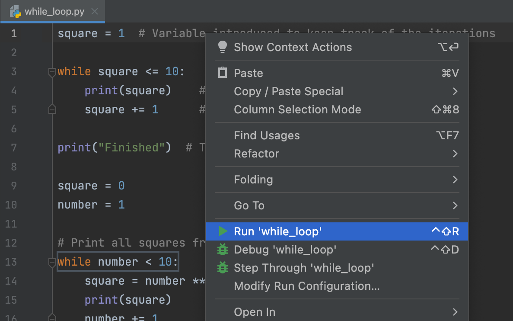

## Editeur de texte

L'<b>Editeurr</b> est l'outil dans lequel vous programmerez. Vous pouvez faire vos expériences en plus de l'apprentissage avec des tâches théoriques et des quizz sans validation.

Pour les tâches de programmation, l'éditeur vous permettra de corriger le code existant ou d'écrire votre propre code depuis le début. Le code pourra ensuite être validé.

Pour lancer votre code à tout moment, cliquez sur le bouton "Run" dans le menu contextuel ou appuyez sur &shortcut:Run;:

Si vous voulez revenir à l'éditeur et vous concentrer sur votre code, la manière la plus simple est d'utiliser la fonction permettant de cacher toutes les autres fenêtres (&shortcut:HideAllWindows;). Pour réafficher toutes les fenêtres, réutilisez la commande.
