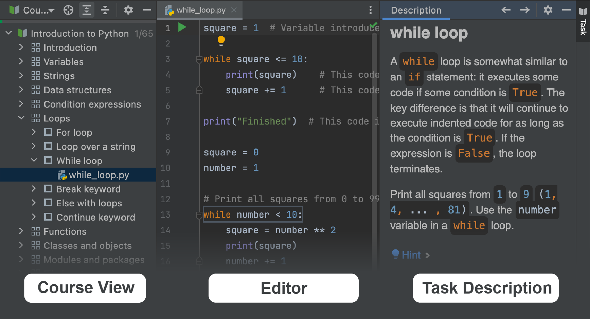

## plugin EduTools  

Cet exercice va vous aider à faire vos premiers pas avec le [plugin EduTools](https://www.jetbrains.com/help/education/educational-products.html) afin de l'utiliser pour apprendre Python.  

Avec ce plugin, vous pouvez apprendre différents langages de programmation au fil de défis pour lesquelles vous aurez un retour immédiat directement dans l'[IDE](https://www.redhat.com/fr/topics/middleware/what-is-ide).  

Vous êtes prêts ? **C'est parti !**  

*Si vous êtes déjà familier avec l'interface, vous pouvez passer ce défi.*  

### Travailler avec les cours EduTools  
Chaque cours EduTools est formé par une liste de leçons. Les leçons peuvent être regroupées par sections. Chaque leçon contient plusieurs défis.

Lorsque vous ouvrez un cours, vous arriverez les outils principaux utilisés pour la navigation : **Course View**, **Editor**, et **Description** :

Cliquer sur le bouton "Next" pour aller sur le prochain défi.
